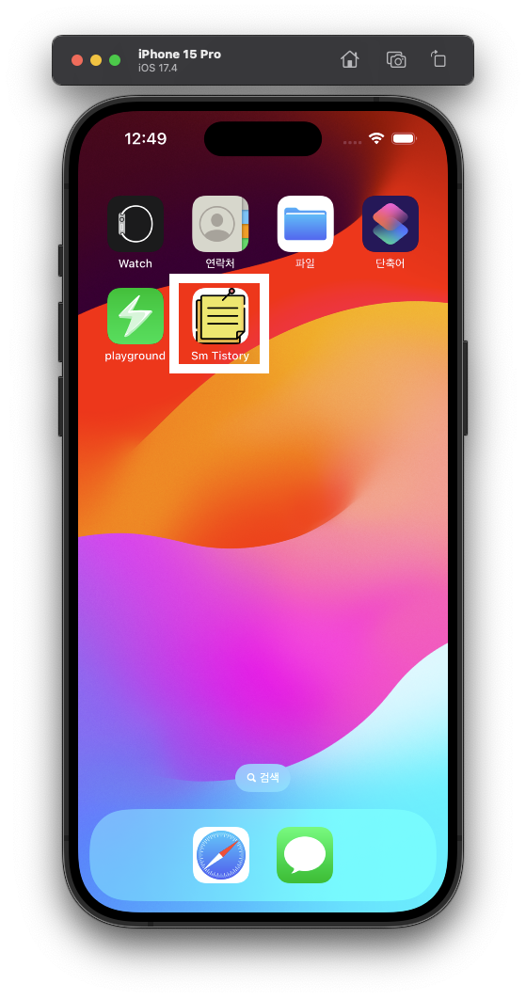
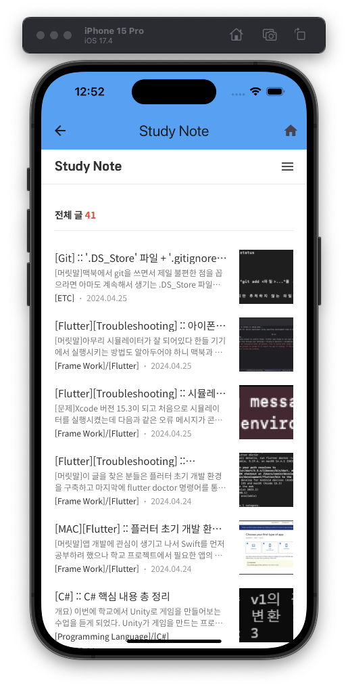
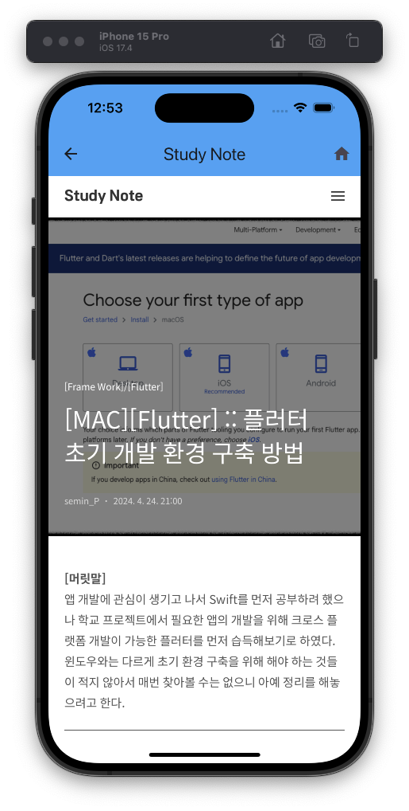

# [Flutter] :: SM Tistory
[머릿말]  
이 repository는 '코드팩토리의 플러터 프로그래밍' 도서를 참고하여 실습한 내용을 담고있다.  
추후 캡스톤 디자인에서 개발된 **Cooper** 사이트의 웹뷰 앱을 개발할 때 활용할 수 있을 것 같다.

## What's this app?
제일 많이 사용된 webview_flutter를 사용하여 간단하게 내 Tistory 블로그를 보여주는  
웹뷰 앱이다. 기존 예제에서 'AppBar'에 뒤로가기 버튼을 추가하였다.  

## 실행 사진
1. 앱 아이콘  
  

2. 메인 화면  
  

3. 포스팅으로 이동한 화면  
